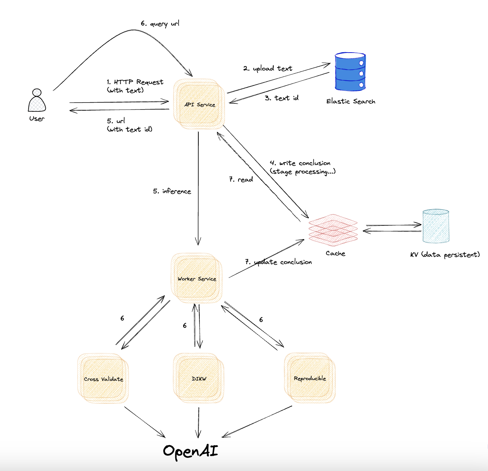

# infoverify
* 交叉验证
  * 基石知识库（如物理、数学等现代科学文章理论，例子如通信原理）
* 可再现性
* 详细数据证明

提供链接，爬文章数据来推理并开一个新 tab（结论链接）来给出答案，移动客户端则可以使用分享给系统的客户端，然后客户端会有记录（包含原文与结论）。  

## 运行
`docker-compose up -d`  

## 停止
`docker-compose down`

## Milestone
* [ ] Article
* [ ] Audio / Video

## 架构
  

* 前后矛盾检查（逻辑匹配）功能
